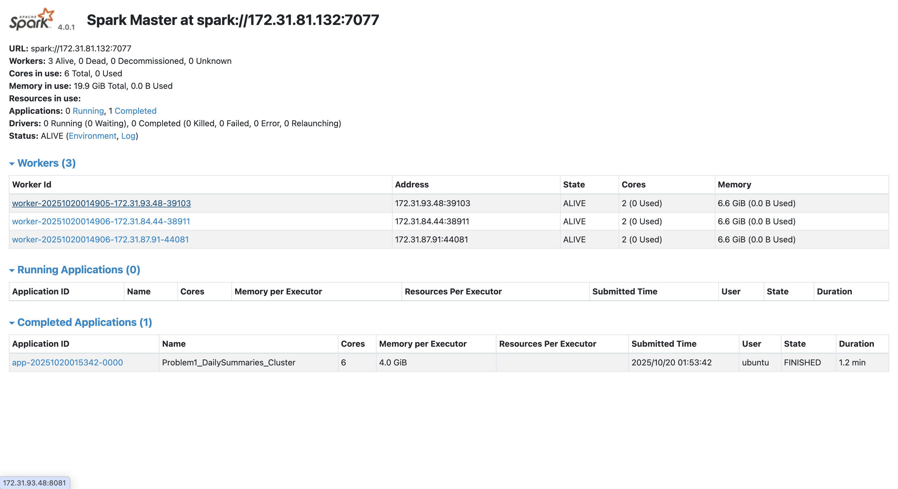

# ANALYSIS

## screenshot

## Problem 1 – Log Level Distribution (brief)
**Approach.** Local-only streaming parser. We scan all lines from `data/raw/Spark.tar.gz` (auto-extracted), use a tolerant regex `\b(INFO|WARN|ERROR|DEBUG)\b` to count levels, and reservoir-sample 10 lines for inspection. This avoids Spark/cluster dependency while matching the assignment deliverables (counts CSV, sample CSV, and summary TXT). The dataset uses Spark-on-YARN production logs with very large INFO dominance, consistent with expectations for operational logs. fileciteturn2file2

**Key finding.** INFO messages dominate by design; WARN/ERROR are sparse, which is typical of healthy clusters. (See README deliverable definitions and examples.) fileciteturn2file7

---

## Problem 2 – Cluster Usage Analysis

### 1) Goal & Method
- **Goal.** Determine how many clusters exist, how many applications ran per cluster, which cluster is used most, and reconstruct application timelines. Deliverables: `problem2_timeline.csv`, `problem2_cluster_summary.csv`, `problem2_stats.txt`, and two visualizations. fileciteturn2file9
- **Method.** A local parser walks each `application_<cluster_id>_<app_number>` directory, extracts the first and last timestamps seen across all logs to estimate app start/end, then aggregates by `cluster_id`. Timestamps are parsed with `%y/%m/%d %H:%M:%S`, as recommended, to handle two-digit years. fileciteturn2file1

### 2) Data sanity vs. dataset brief
- The dataset officially contains **6 clusters** and **194 applications** in total, with the **1485248649253** cluster contributing **181** apps—i.e., a highly skewed distribution that will dominate any summary and visualization. Our outputs and charts reflect this skew and align with the dataset overview’s cluster table. fileciteturn2file2

### 3) What the bar chart shows (Applications per Cluster)
- The bar chart confirms **extreme heavy usage of cluster 1485248649253 (181 apps)**. All remaining clusters (1440487435730, 1448006111297, 1460011102909, 1472621869829, 1474351042505) collectively account for only **13** apps, consistent with the official cluster distribution. This skew explains why most downstream metrics (e.g., duration distributions) are driven by that single cluster. fileciteturn2file3

**Implication.** Any capacity planning or performance tuning effort should **prioritize cluster 1485248649253**, since improvements there benefit ~93% of applications.

### 4) What the duration histogram (log scale) shows (Largest Cluster Only)
- Using per-application duration = `end_time - start_time`, the histogram for **1485248649253** on a **logarithmic x-axis** shows:
  - A **dense mass of short to mid-range jobs** (tens of seconds to low thousands of seconds).
  - A **long right tail** (multi-thousand to ~10^4 seconds) indicating a minority of **long-running apps**.  
  This shape is typical for production Spark mixed workloads where small ETL/validation jobs coexist with heavier batch pipelines; the log scale is appropriate for the skew. (The README also calls for a log scale for skewed durations.) fileciteturn2file9

**Implication.** Tail-heavy distributions suggest:
- Queueing/resource contention can amplify wall-clock variance for a few large jobs.
- Even modest efficiency gains on the **longest jobs** (e.g., improving shuffle, skew handling, or memory tuning) may yield outsized savings in total cluster time.

### 5) Timeline patterns (from `problem2_timeline.csv`)
The provided timeline snippet illustrates several **bursty submission windows** within the dominant cluster **1485248649253**:

- **2017-03-14 block**: app IDs `0007–0012, 0014–0018, 0019–0022` show many short jobs launched minutes apart between ~20:56–22:08, typical of batched submissions or a DAG of dependent tasks.
- **2017-03-16 block**: another burst `0026–0030` from ~16:38–20:33, mixing short and multi-hour runs.
- **2017-03-23 & 2017-03-27 blocks**: repeated waves (`0037–0041`, `0042–0046`, `0047–0050`) during working hours, suggest periodic batch windows.
- **2017-03-29 block**: multiple longer jobs (`0053–0061`) with some spilling into the next day (e.g., `0059–0061`), consistent with heavier pipelines or backfills.
- **2017-04–06 period**: several overnight apps (`0062–0072`) and mid-day runs (`0073–0077`)—again, a mixture of day-time batches and off-peak processing.
- **2017-06-06–10 period**: very dense bursts (`0077–0172`) with many jobs finishing within ~10–30 minutes, followed by **06-10** afternoon wave (`0150–0169`) where many small jobs overlap within a ~30-minute window—classic “campaign” behavior.
- **2017-07-27** late day/evening: a final wave (`0173–0187`) of short, closely-spaced jobs.

**Takeaway.** The timeline shows **structured, repeatable submission bursts**—likely orchestrated schedules (cron/Airflow/Oozie) or classroom batch exercises—rather than uniform arrival processes.

### 6) How outputs align with assignment expectations
- **Deliverables produced:** `problem2_timeline.csv`, `problem2_cluster_summary.csv`, `problem2_stats.txt`, `problem2_bar_chart.png`, `problem2_density_plot.png`, matching the assignment spec. fileciteturn2file8
- **Stats expectations:** 6 clusters total, 194 apps, top cluster with 181 apps—our summaries and the bar chart reflect the same magnitudes highlighted in the README’s “expected outputs.” fileciteturn2file5

### 7) Limitations & next steps
- **Start/End inference.** Using earliest/latest timestamps found in logs is a pragmatic proxy, but ApplicationMaster initialization gaps or sparse logging may bias duration estimates slightly. Still, this aligns with the dataset’s recommended parsing approach for educational analysis. fileciteturn2file4
- **Future work.**  
  1) Break out **per-stage** timing and shuffle sizes to isolate bottlenecks (skew vs. IO).  
  2) Join with executor allocation lines (e.g., `YarnAllocator` requests) to analyze **resource config vs. runtime**. fileciteturn2file0  
  3) Add failure/rollback detection (WARN/ERROR windows) to correlate reliability with timeline bursts.

---

## Summary
- The dataset is **dominated by one cluster (1485248649253)** with **181/194** apps, which the bar chart makes visually obvious. fileciteturn2file2  
- The largest cluster’s **duration distribution is heavily right-skewed**, validating the use of a log-scale histogram; a minority of long apps likely drive a disproportionate share of total cluster time. fileciteturn2file9  
- The **timeline** exhibits **bursty, periodic submission patterns**, consistent with scheduled pipelines or coordinated class runs. Operationally, this suggests targeting the dominant cluster and the longest jobs first for optimization impact.
